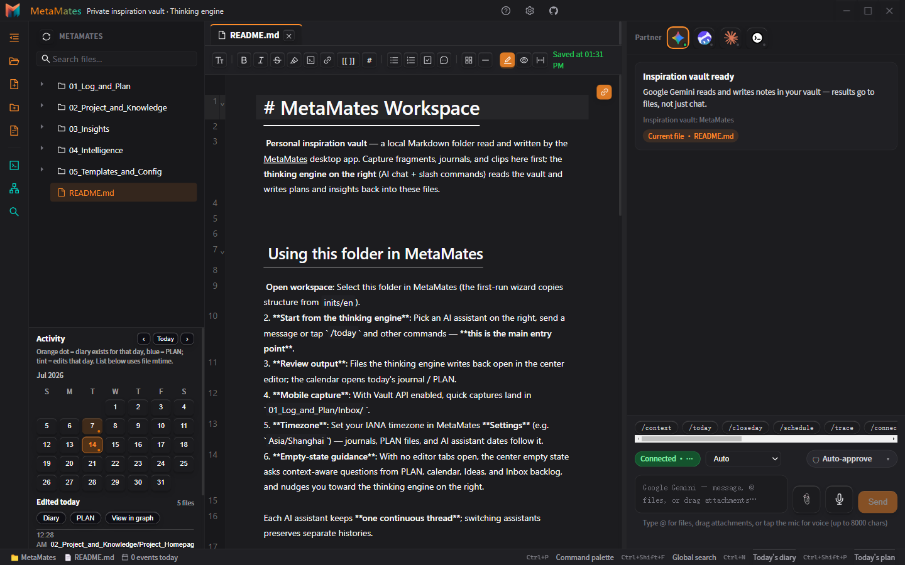
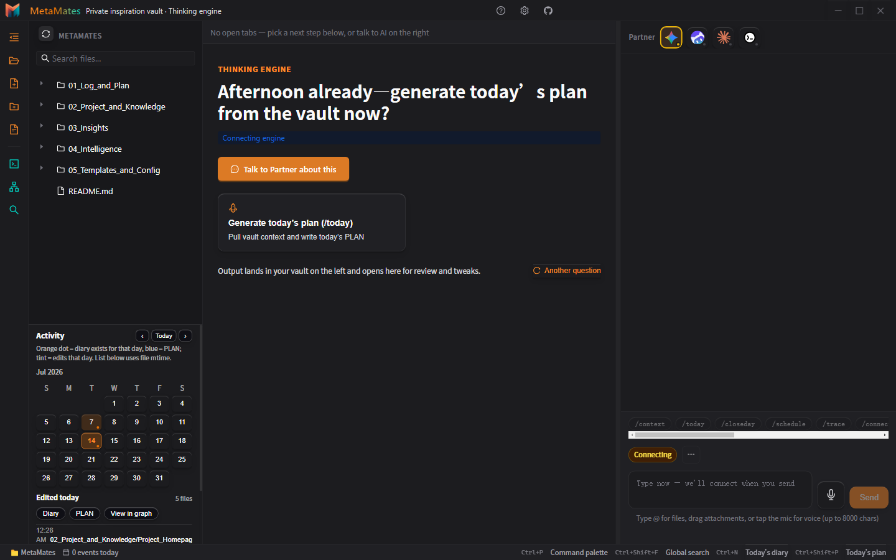
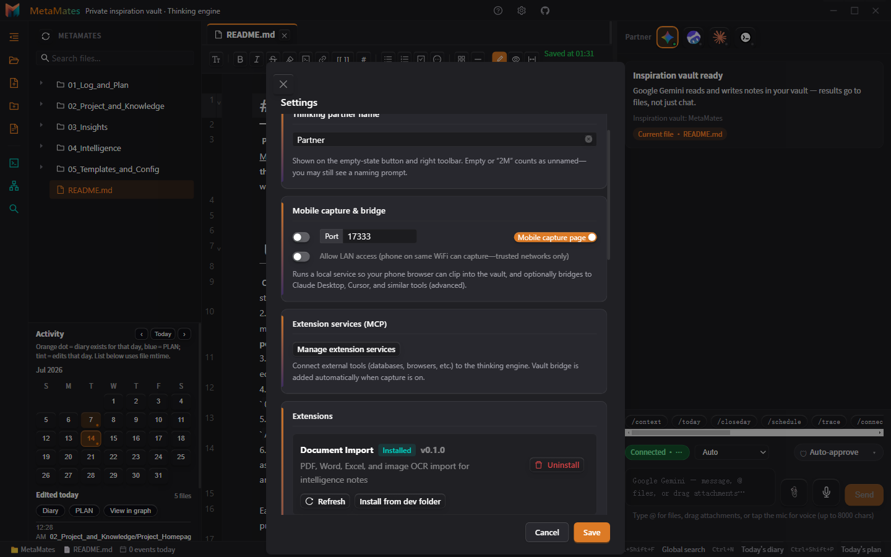

# MetaMates

<p align="center">
  
</p>

<p align="center">
  <strong>Private inspiration vault + thinking engine</strong>
</p>

<p align="center">
  <a href="README.md"></a>
  &nbsp;
  <a href="README.en.md"></a>
</p>

<p align="center">
  <a href="https://github.com/qdljywz/MetaMates/releases"></a>
  <a href="metamates-app/LICENSE"></a>
  
</p>

---

## In one sentence

MetaMates is a **desktop Electron app**: a local Markdown vault on the left, a thinking engine on the right.  
Chat or run `/today` `/graduate`—**results are written back into your notes**, not left only in the chat transcript.

---

## Screenshots

### Main UI — vault · editor · thinking engine



### Empty state — next step when no tab is open



### Settings — AI assistants & optional extensions



---

## Who it’s for

- You want ideas, journals, and plans as **files on your machine**
- You want AI that **writes back to the vault**, not chat-only answers
- You’re fine installing a local CLI (Gemini / Claude / CodeBuddy, …)

## Who it’s not for

- Pure web chat clients  
- Team collaboration, forced cloud sync, or enterprise SSO  

---

## Get started

1. **Download or build** → [Releases](https://github.com/qdljywz/MetaMates/releases) (or build commands below if no installer yet)  
2. **Pick a vault folder** (seed from `inits/en` if you like)  
3. **Connect an AI assistant** in Settings → talk or run slash commands on the right  

```bash
git clone https://github.com/qdljywz/MetaMates.git
cd MetaMates/metamates-app
npm ci
npm run start
# npm run electron:build:win:portable
```

User guide: [USER_GUIDE.md](metamates-app/docs/USER_GUIDE.md)

---

## Slash commands (15)

| Daily | `/context` `/today` `/closeday` `/schedule` `/sync` |
| Thinking | `/trace` `/connect` `/challenge` `/ghost` |
| Ideas | `/ideas` `/graduate` `/drift` `/emerge` `/intel` |
| Planning | `/soal` |

---

## v0.1.0

- Desktop: file tree, multi-tab Markdown, note graph, search, Chinese / English UI  
- Thinking engine: multiple assistants + write-back to PLAN / Inbox / notes  
- Optional extensions: document import, offline speech  
- MIT · CI · packaging scripts  

Changelog: [CHANGELOG.md](metamates-app/CHANGELOG.md) · Positioning: [POSITIONING.md](metamates-app/docs/POSITIONING.md)

---

## License

MIT — [metamates-app/LICENSE](metamates-app/LICENSE)

<p align="center"><sub>MetaMates · open-source v0.1.0 · 2026</sub></p>
