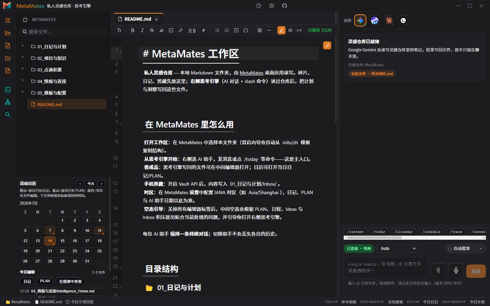
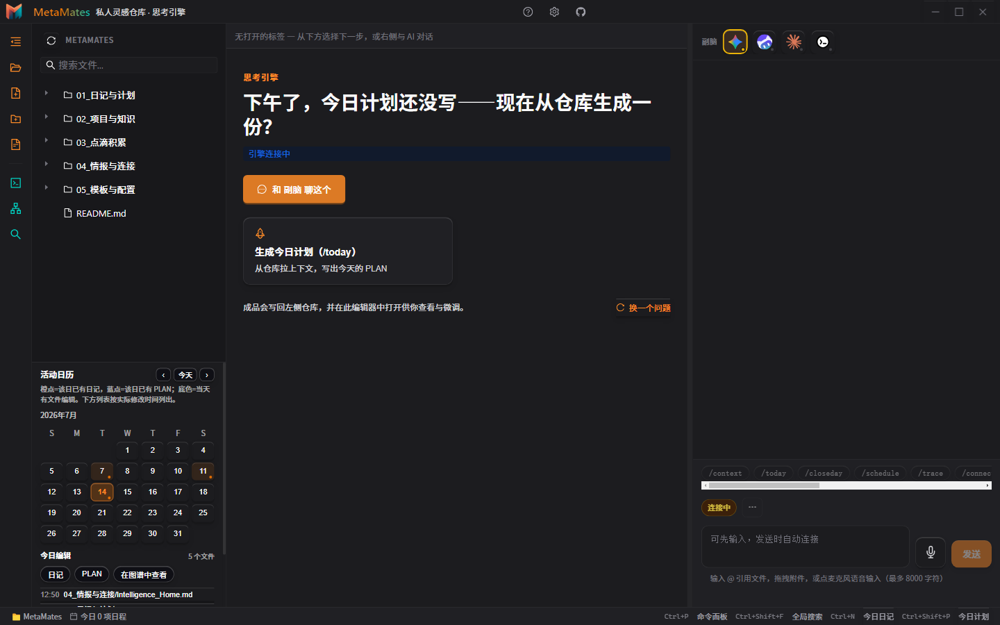
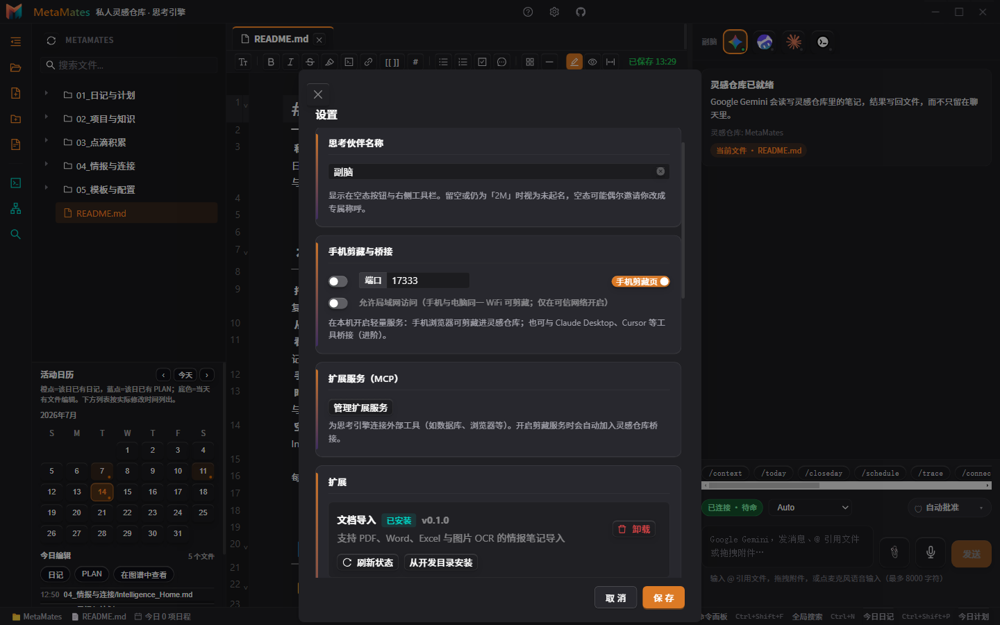

# MetaMates

> **私人灵感仓库 + 思考引擎** — 本机 Markdown 文件夹，右侧 AI 读写同一目录；斜杠命令把成品写回笔记。

<p align="center">
  <a href="../README.md"></a>
  &nbsp;
  <a href="../README.en.md"></a>
</p>

GitHub 默认主页为仓库根目录纯中文 [README.md](../README.md)；英文版见 [README.en.md](../README.en.md)。


---

## 界面预览

| 主界面 | 思考引擎空态 | 设置 · 扩展 |
|:---:|:---:|:---:|
|  |  |  |

截图由 `npm run docs:screenshots` 分别生成中/英界面（`*.zh.png` / `*.en.png`）。

---

## 一句话

**MetaMates = 私人灵感仓库 + 思考引擎。** 安装在本机的 **Electron 桌面应用**：灵感进本地文件夹，右侧对话或运行 `/today`、`/trace` 等 **15** 条命令——结果写回笔记，不消失在聊天里。

---

## 我们是 / 不是

| 我们是 | 我们不是 |
|--------|----------|
| 私人灵感仓库 + 思考引擎（本地 Markdown，AI 读写同一目录） | 聊完即散的纯 Chat 客户端 |
| 日常从右侧开工；中间编辑器查看与修改写回的成品 | 必须订阅的云笔记 SaaS |
| 每个已连接助手一条持续对话 | 团队协作 / 强制云同步产品 |

界面三栏是为了**思考与文件在一起**，不是「再做一个聊天 App」。定位全文：[docs/POSITIONING.md](docs/POSITIONING.md) · 桌面架构：[docs/DESKTOP_APP.md](docs/DESKTOP_APP.md)

---

## 核心能力

| 模块 | 说明 |
|------|------|
| **灵感仓库** | 双链、标签、全文搜索（含轻量相关匹配）、关系图、多标签编辑、自动保存 |
| **思考引擎** | 右侧选助手、15 条斜杠命令、工具调用卡片；输出写回仓库 |
| **手机剪藏（可选）** | 开启本机局域网接口后，手机可向 Inbox 投递；不是思考引擎主入口 |
| **可选扩展** | 文档导入、离线语音；以及本机 MCP / Ollama 等增强 |

---

## 界面结构

```text
┌──────────┬─────────────────────────┬──────────────────┐
│ 灵感仓库  │  编辑器（查看与修改成品） │  思考引擎（主入口）│
│ 文件树    │  Markdown · 双链 · 标签  │  对话 + 斜杠命令  │
│ 日历/搜索 │                         │                  │
└──────────┴─────────────────────────┴──────────────────┘
```

---

## 斜杠命令（15）

| 类别 | 命令 |
|------|------|
| 日常 | `/context` `/today` `/closeday` `/schedule` `/sync` |
| 思考 | `/trace` `/connect` `/challenge` `/ghost` |
| 灵感 | `/ideas` `/graduate` `/drift` `/emerge` `/intel` |
| 规划 | `/soal`（写入 `05_…/2M.md`） |

`/intel`：桌面端先完成本地抓取，助手再摘要并写回「情报与连接」。

---

## 快速开始

### 系统要求

- **用户**：Windows 10+ 或 macOS 12+；至少一个本机可用的 AI 命令行助手（Gemini / Claude / CodeBuddy 等）。应用**不托管**大模型。
- **开发者构建**：Node.js 20+

### 用户

1. 打开 [GitHub Releases](https://github.com/qdljywz/MetaMates/releases) 下载安装包（若尚无附件，见下方自行构建）  
2. 运行 **MetaMates**（桌面窗口）  
3. 首启：选择或初始化工作区文件夹  
4. 在设置中连接 AI 助手  
5. 右侧发消息或运行 `/today` 等；在中间打开写回的笔记  

```bash
# Windows 便携调试包（发版附件未就绪时）
npm ci
npm run electron:build:win:portable
```

### 开发者

```bash
cd metamates-app
npm ci
npm run start          # Electron 开发（推荐）
# npm run dev         # 仅 Vite 预览：无完整文件系统与助手
```

默认验证工作区：`e2e/.workspace/vault`（首次从 `inits/zh` 复制）。可用 `METAMATES_WORKSPACE` 覆盖。

```bash
npm run check:opensource
npm run verify:round
npm run electron:build:win
```

---

## 工作区模板

首次初始化会从 [`inits/zh`](inits/zh) 或 [`inits/en`](inits/en) 复制目录与助手配置：

| 目录 | 说明 |
|------|------|
| `01_…` | 日记、PLAN、**Inbox** 剪藏缓冲 |
| `02_…` | 长期项目 |
| `03_…` | 原子笔记 |
| `04_…` | 外部资料 |
| `05_…` | Master Control、`2M.md`、CLI 协议 |

**Inbox**：剪藏 → `/graduate` 整理为长期笔记 → 源文件进入 `Inbox/processed/`。

随模版复制的助手资产：`.claude/skills/`、`.codebuddy/skills/`、`.gemini/skills/` 及对应 `*.md` 协议文件。

用户手册：[docs/user-manual.html](docs/user-manual.html) · [docs/USER_GUIDE.md](docs/USER_GUIDE.md)

---

## 参与贡献

见 [CONTRIBUTING.md](CONTRIBUTING.md) · [CODE_OF_CONDUCT.md](CODE_OF_CONDUCT.md) · [SECURITY.md](SECURITY.md)

贡献者测试约定（UX 护栏编号等）见 [docs/UX_REGRESSION_GUARDRAILS.md](docs/UX_REGRESSION_GUARDRAILS.md)，不面向最终用户介绍页。

---

## 技术栈

React 19 · TypeScript · Electron 33 · CodeMirror 6 · 本机 AI 会话协议 · SQLite · Vite 7

---

## 文档

| 文档 | 说明 |
|------|------|
| [用户指南](docs/USER_GUIDE.md) | 操作说明 |
| [产品定位](docs/POSITIONING.md) | 边界与叙事 |
| [扩展架构](docs/PLUGINS.md) | document-import / offline-speech |
| [个人版范围](docs/PERSONAL_SCOPE.md) | 做 / 不做 |
| [开源清单](docs/OPEN_SOURCE.md) | 应公开 / 应 ignore |
| [打包指南](docs/PACKAGING.md) | Windows / macOS |
| [发版清单](docs/RELEASE_CHECKLIST.md) | tag / Release 前检查 |
| [SECURITY.md](SECURITY.md) | 漏洞报告 |
| [API](docs/API.md) · [IPC](docs/IPC_Protocol.md) | 开发者参考 |

---

## 许可证

MIT — 见 [LICENSE](LICENSE)

---

*MetaMates · 开源 v0.1.0 · 2026*
