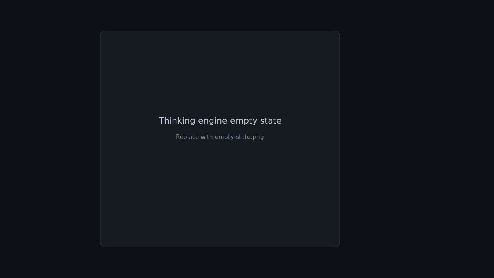

# MetaMates

> **私人灵感仓库 + 思考引擎** — 本地 Markdown 工作区承载碎片与计划，右侧 AI 助手读写同一文件夹；15 条 slash 命令把成品写回笔记，而不是消失在聊天里。  
> Private inspiration vault + thinking engine — local Markdown workspace; AI assistants on the right read and write the same folder.


---

## 界面预览 / Screenshots

| 主界面 | 思考引擎空态 | 扩展 |
|:---:|:---:|:---:|
|  |  |  |

替换为真实截图：`docs/screenshots/main-ui.png` 等（见 [docs/screenshots/README.md](docs/screenshots/README.md)）。GitHub 主页见 [仓库根 README](../README.md)。

---

## 一句话 / One-liner

**MetaMates = 私人灵感仓库 + 思考引擎。** 安装在本机的 **Electron 桌面应用**（不是网页）：灵感丢进本地 Markdown 仓库，右侧和 AI 对话或跑 `/today`、`/trace` 等 15 条命令——成品写回笔记，不消失在聊天里。

---

## 我们是什么 / 不是什么

| ✅ 我们是 | ❌ 我们不是 |
|-----------|------------|
| **私人灵感仓库** + **思考引擎**（本地 Markdown，AI 读写同一文件夹） | 纯 Chat 客户端 |
| 右侧思考引擎为主入口 + 中间编辑器看成品 | 三栏「聊天 App」布局 |
| 每个 AI 助手一条持续对话 | 多会话 / 对话树 |
| 数据在本地 Markdown | 强制云同步 SaaS |

详细定位见 [docs/POSITIONING.md](docs/POSITIONING.md) · 桌面架构见 [docs/DESKTOP_APP.md](docs/DESKTOP_APP.md)

---

## 核心能力

| 模块 | 说明 |
|------|------|
| **灵感仓库** | `[[双链]]`、`#标签`、全文 + 语义搜索、关系图谱、多标签编辑、自动保存 |
| **思考引擎** | 右侧选 AI 助手、15 条 slash 命令、工具调用卡片；输出写回仓库 |
| **Vault API** | 手机 `/mobile` 只读 + `POST /api/capture` 写入 Inbox |
| **MCP / Ollama** | 可选扩展本机 Agent 能力 |

---

## 界面结构

```text
┌──────────┬─────────────────────────┬──────────────────┐
│ 灵感仓库  │  编辑器（查看与修改成品） │  思考引擎（主入口）│
│ 文件树    │  Markdown · 双链 · 标签  │  AI 对话 + slash │
│ 日历/搜索 │                         │  命令            │
└──────────┴─────────────────────────┴──────────────────┘
```

---

## 方法论命令（15）

| 类别 | 命令 |
|------|------|
| 日常 | `/context` `/today` `/closeday` `/schedule` `/sync` |
| 思考 | `/trace` `/connect` `/challenge` `/ghost` |
| 灵感 | `/ideas` `/graduate` `/drift` `/emerge` `/intel` |
| 规划 | `/soal`（写入 `05_…/2M.md` 进化层） |

> `/intel` 由桌面端先完成本地抓取（网页/PDF/图片等），Agent 再深化摘要并写回 `04_情报与连接/`。

---

## 快速开始

### 系统要求

- **Node.js 20+**（仅开发者构建时需要）
- **Windows 10+** 或 **macOS 12+**（Apple Silicon / Intel）
- 至少一个已安装的 ACP CLI（Gemini / Claude / CodeBuddy 等，可选）

### 用户

1. 从 [GitHub Releases](https://github.com/qdljywz/MetaMates/releases) 下载安装包，或自行 `npm run electron:build:win` / `:mac`
2. 运行 **MetaMates**（**桌面窗口**，不是浏览器）
3. 首启向导：选择/初始化灵感仓库文件夹
4. 安装并连接至少一个 AI 助手（Gemini / Claude / CodeBuddy 等）
5. 在右侧思考引擎发消息或运行 `/today` 等命令；中间编辑器查看写回的成品

### 开发者

```bash
cd metamates-app
npm ci
npm run start          # Electron 开发（推荐）
# npm run dev         # 仅 Vite 浏览器预览，无文件系统与 Agent
```

默认验证工作区为 `e2e/.workspace/vault`（首次从 `inits/zh` 自动复制；见 `e2e/E2E_WORKSPACE.md`）。可通过 `METAMATES_WORKSPACE` 覆盖。

```bash
npm run check:opensource
npm run verify:round   # tsc + 单测 + 功能检查
npm run electron:build:win
```

---

## 参与贡献

见 [CONTRIBUTING.md](CONTRIBUTING.md) · [CODE_OF_CONDUCT.md](CODE_OF_CONDUCT.md) · [SECURITY.md](SECURITY.md)

---

## 工作区模板

首次初始化工作区时，会从 [`inits/zh`](inits/zh) 或 [`inits/en`](inits/en) 复制标准目录与 Agent 配置：

| 目录 | 中文 | 英文 | 说明 |
|------|------|------|------|
| `01_…` | 日记与计划 | Log and Plan | 日记、`PLAN`、**Inbox/** 剪藏缓冲（出厂为空） |
| `02_…` | 项目与知识 | Project and Knowledge | 长期项目与结构化知识 |
| `03_…` | 点滴积累 | Insights | 原子笔记与灵感 |
| `04_…` | 情报与连接 | Intelligence | 外部资料与连接 |
| `05_…` | 模板与配置 | Templates and Config | `Master_Control.md`、`2M.md`、CLI 协议 |

**Inbox 流程**：手机剪藏与临时捕获 → `01_…/Inbox/` → `/graduate` 升维为永久笔记 → 源文件移至 `Inbox/processed/`（运行时目录）。

**随模版复制的 Agent 资产**（工作区根目录）：`.claude/skills/`、`.codebuddy/skills/`、`.gemini/skills/` 及 `GEMINI.md` / `CLAUDE.md` / `CODEBUDDY.md`。

工作区内的说明见初始化后的 [`inits/zh/README.md`](inits/zh/README.md)（或英文版）。

**用户手册**：[docs/user-manual.html](docs/user-manual.html)（浏览器打开）· [docs/USER_GUIDE.md](docs/USER_GUIDE.md)

---

## 技术栈

React 19 · TypeScript · Electron 33 · CodeMirror 6 · ACP (JSON-RPC) · SQLite 会话存储 · Vite 7

---

## 文档

| 文档 | 说明 |
|------|------|
| [用户指南](docs/USER_GUIDE.md) | 操作说明 |
| [产品定位](docs/POSITIONING.md) | 边界与路线图 |
| [扩展架构](docs/PLUGINS.md) | document-import / offline-speech |
| [个人版范围](docs/PERSONAL_SCOPE.md) | 做 / 不做 |
| [开源文件清单](docs/OPEN_SOURCE.md) | 应公开 / 应 ignore（monorepo） |
| [打包指南](docs/PACKAGING.md) | Windows / macOS · portable-green |
| [发版清单](docs/RELEASE_CHECKLIST.md) | tag / Release 前检查 |
| [UX 回归护栏](docs/UX_REGRESSION_GUARDRAILS.md) | UX-01～38，贡献者测试约定 |
| [SECURITY.md](SECURITY.md) | 漏洞报告 |
| [CONTRIBUTING.md](CONTRIBUTING.md) | 贡献流程 |
| [API](docs/API.md) · [IPC](docs/IPC_Protocol.md) | 开发者参考 |

---

## 许可证

MIT — 见 [LICENSE](LICENSE)

---

*MetaMates · 首发开源 v0.1.0 · 2026-07-13*
